 

## License

This project is licensed under the MIT License - see the [LICENSE](LICENSE) file for details.

  
<!-- project overview -->

> Aegis-Ignis is an intelligent smart building security system that combines real-time fire detection, face recognition, and occupancy monitoring  
>The system provides instant visibility, intelligent alerts, and rapid emergency response through a unified platform that keeps people safe and assets protected.

 
<!-- System Design -->

### System Architecture

 

### Microservices Architecture  

### Entity Relationship Diagram

### n8n
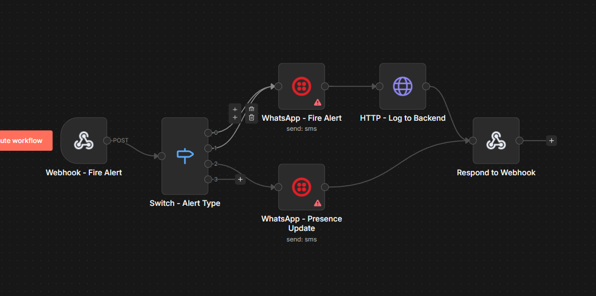
  
<!-- Project Highlights -->

### Core Features

-ML: YOLOv8-based fire and smoke detection. 
-Face Recognition: Fast employee identification using InsightFace embeddings.  
-Multi-Channel Alerts: WhatsApp, SMS, and voice notifications via N8N with severity based routing 
-Employee Registration Portal: Simple face registration with photo upload and automatic embedding generation 
 
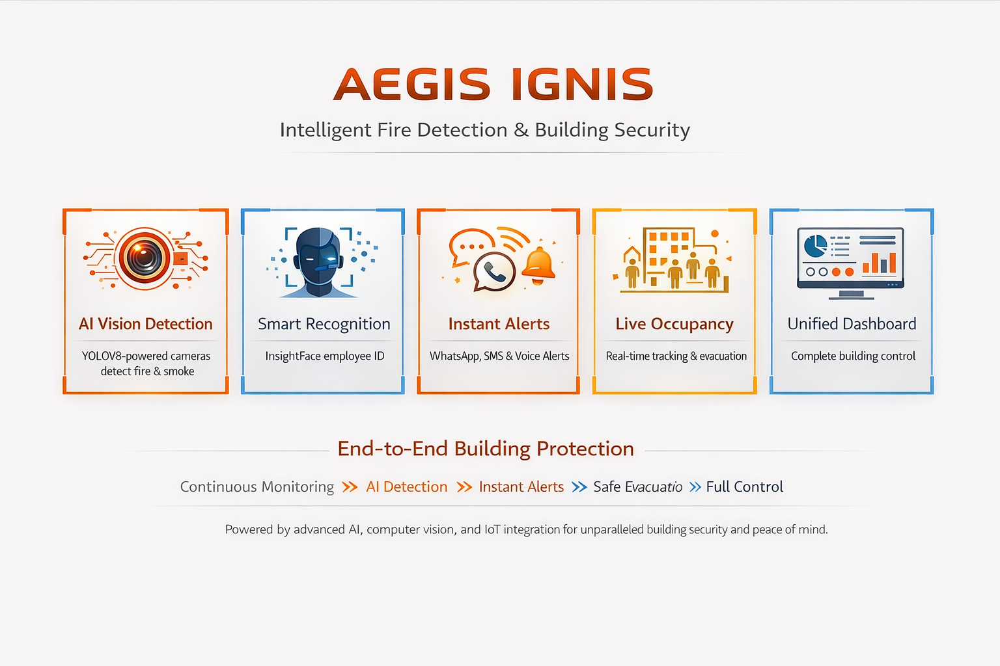
 
<!-- Demo -->

### System Screenshots

| Dashboard Overview | Login Overview | Camera Management |
| ------------------ | -------------- | ----------------- |
|  |  | 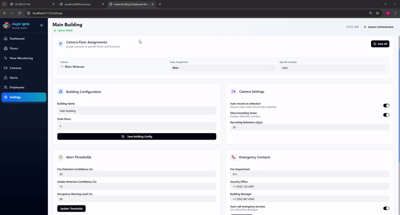 |

| Fire Alerts | Employee Management | Face Registration |
| ----------- | ------------------- | ----------------- |
| 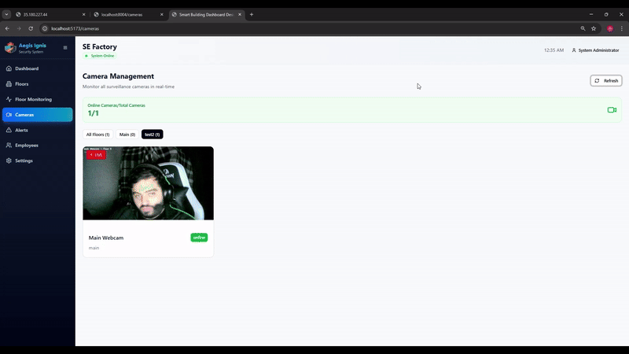 | 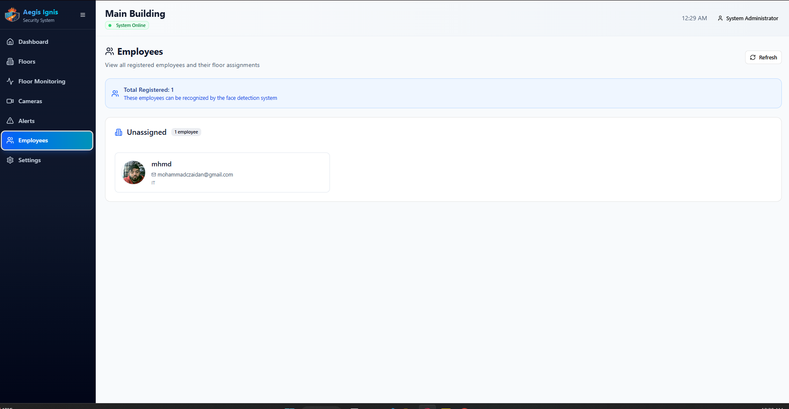 |  |

 

| Mobile Overview |
| ---------------------------------------| 
| 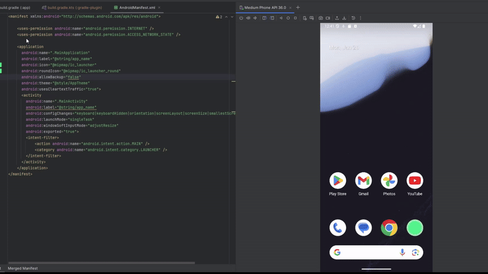  |

  

<!-- Development & Testing -->

### Tests

 | Test Coverage |
 | ------------------------------------- |
 | 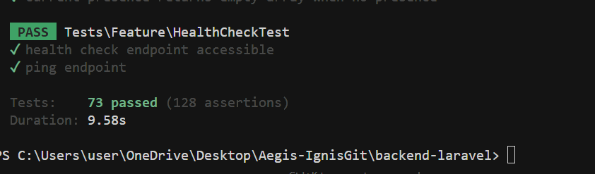 |

- **Backend tests**: `cd Server && php artisan test`
- **Python services**: Unit tests for ML models and detection algorithms
- **Frontend tests**: React component testing with Vitest

 

### Machine Learning Development
 | Model Performance |
 | ------------------------------------- |
|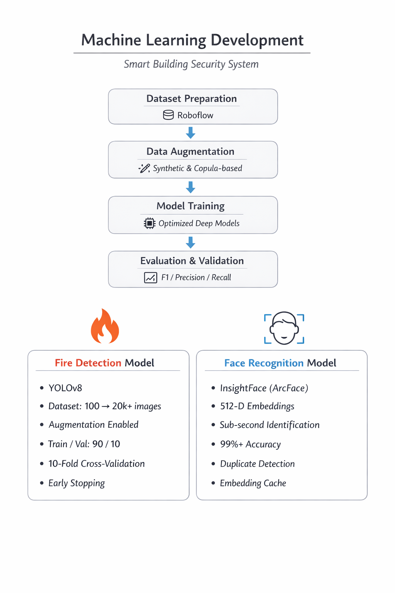 |

| Training Dataset | Model Performance |
| --------------------------------------- | ------------------------------------- |
|  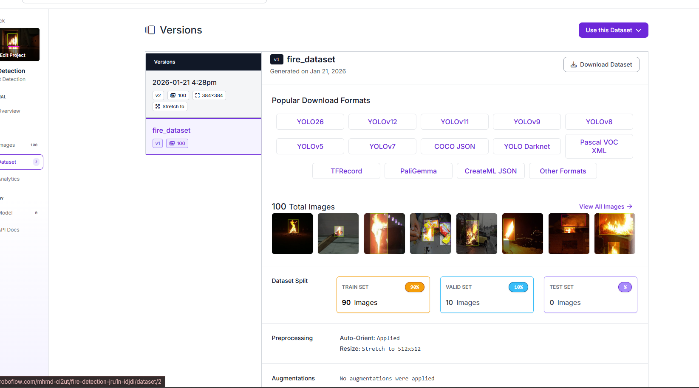 | |

 

### N8N Workflow Automation

The system uses N8N for intelligent alert routing and multi-channel notifications:

- **Webhook Trigger**: Receives fire alerts from Alert Manager
- **Alert Type Routing**: 
  - `FIRE_EMERGENCY`: Standard fire detection alerts
  - `CRITICAL_EVACUATION`: Alerts when people are present on floor
  - `PRESENCE_UPDATE`: Regular occupancy updates
- **Multi-Channel Delivery**: WhatsApp, SMS, Voice calls based on severity
- **Backend Integration**: Automatic logging and alert history updates

Workflow configuration available in `n8n-workflow-fire-alert.json`
  
### Additional Tools & Services

| Tool | Purpose |
|------|---------|
| **N8N** | Workflow automation for multi-channel alerts |
| **Twilio** | WhatsApp,  and Voice call integration |
| **MLFlow** | ML model tracking and registry |
| **PostgreSQL** | Primary database for all system data |
| **Docker** | Containerized PostgreSQL deployment |

  
<!-- Extras -->
 

| Dockers |  Postman |
| ----------- |  ----------------- | 
| 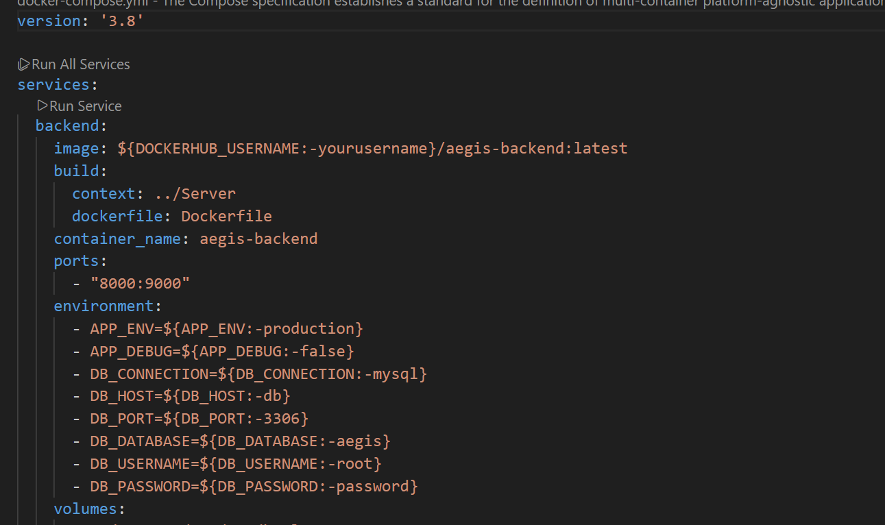 |  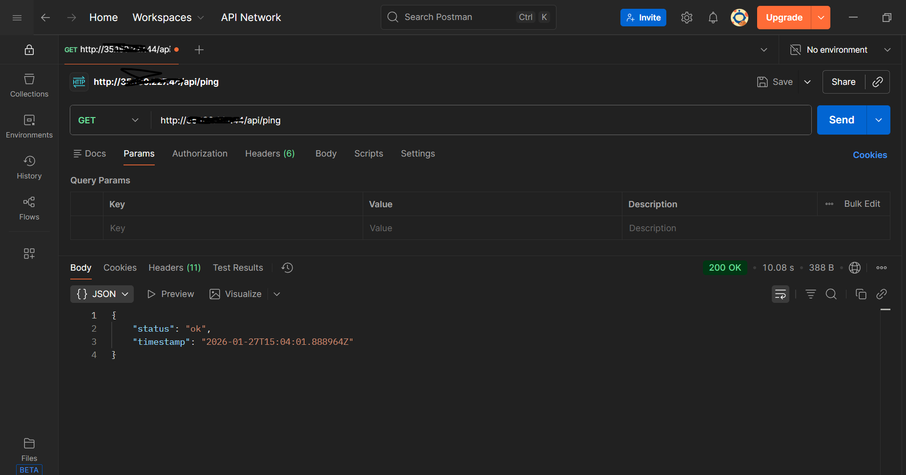 | 

 

 | CI/CD Pipeline |
 | ----------------- |
 | 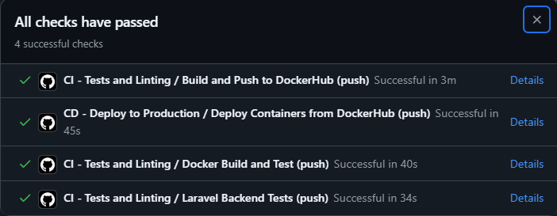

  
---

**Aegis-Ignis** - Intelligent Smart Building Security System

*Protecting buildings, one detection at a time.*
